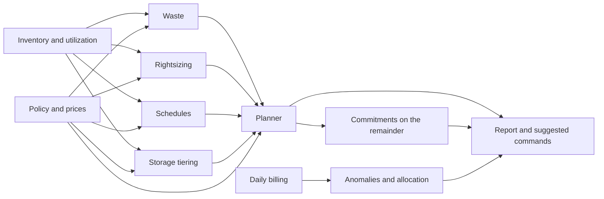

# Cloud Optimization Agent

Feed it an inventory, some utilization figures and a month of daily billing, and it tells you where the money
is going to waste and what to do about it. It finds idle and orphaned resources, oversized instances,
non-production machines that run all night, cold data in the expensive storage tier, and steady compute worth a
commitment. It also spots cost anomalies in the billing and shows spend by team, application and environment.

The part that matters most is the plan. Recommendations for one resource interact: you cannot rightsize what you
delete, and a rightsized machine that you then schedule saves less than either change alone. The planner applies
changes in a fixed order and computes each saving against what is left, so the total is a number you can budget
against instead of a sum of overlapping claims.

Nothing here changes your cloud. Suggested commands are printed for a person to review.

## What it does

| Stage | Analyzer | Finds |
| ----- | -------- | ----- |
| 1 | Waste | Idle instances and databases, unattached disks, disks of long-stopped machines, orphaned snapshots, unassociated addresses, unused load balancers and NAT gateways |
| 2 | Rightsizing | A smaller (or newer, cheaper) size that still keeps CPU and memory headroom at the 95th percentile |
| 3 | Schedules | Non-production compute used a fraction of the week |
| 4 | Storage tiering | Buckets nobody has read for months, moved to infrequent or archive tiers after allowing for retrieval fees |
| 5 | Planner | Orders and de-duplicates the above, blocks protected resources, and sizes commitments on what is left |
| 6 | Anomalies | Services whose recent daily cost is far above their own history, with the resources responsible |
| 7 | Allocation | Monthly cost by tag value, and how much is untagged |



## Quick start

```bash
python -m venv .venv && source .venv/bin/activate     # Windows: .venv\Scripts\activate
python -m pip install -e ".[dev]"

cloudopt simulate --out feeds --today 2026-09-19
cloudopt analyze --inventory feeds/inventory.jsonl --billing feeds/billing.jsonl \
    --today 2026-09-19 --out out
```

The simulator writes a 59-resource estate across AWS, Azure and GCP with the usual problems, and 30 days of
billing. All figures are invented.

### Example output

```text
59 resources cost about $8,025 a month. 39 recommendations would save about $3,398 a month ($40,771 a year,
42.3% of spend). Largest sources: rightsize ($909), remove waste ($831), tier cold storage ($828).
1 more are blocked by protection rules. 1 cost anomaly(ies) need attention.
```

| Category | Monthly saving |
| -------- | -------------- |
| Remove waste | $830.70 |
| Rightsize | $909.30 |
| Schedule non-production | $188.56 |
| Tier cold storage | $828.00 |
| Commit to steady usage | $641.06 |

A few of the 39 recommendations:

| Recommendation | Current a month | Saving a month | Confidence | Risk |
| -------------- | --------------- | -------------- | ---------- | ---- |
| Move s3-logs-archive to archive storage | $920.00 | $748.00 | high | low |
| Commit to 1y of steady aws compute | $1,906.00 | about $427 | medium | medium |
| Resize web-05 from m5.2xlarge to m7i.xlarge | $280.32 | $151.55 | high | medium |
| Idle instance: dev-sandbox-01 | $140.16 | $140.16 | high | medium |
| Schedule staging-01 (staging) | $70.08 | $47.14 | high | low |
| Unattached disk: vol-lost3 | $40.00 | $15.00 | high | low |

Some behaviour worth noticing in that output:

- The web fleet is rightsized from `m5.2xlarge` to `m7i.xlarge`, which is both smaller and a newer generation.
  Memory was checked too. The same fleet at 60% memory would not have been shrunk.
- The commitment is sized after the deletions, rightsizing and schedules, on 11 instances that have run for at
  least 30 days, at 80% coverage of the spend that remains. It does not cover the idle machines, the scheduled
  test machines or the GPU instance that appeared eight days ago.
- The unattached disks save $15 of $40, not $40, because the plan keeps a final snapshot.
- `legacy-billing` is idle but tagged `do-not-optimize`. It appears under "Blocked by protection rules" with
  the $140 it would have saved, and it is also kept out of the commitment.
- The GPU instance `ml-experiment-07` is not a waste finding because it has only eight days of data. It is caught
  by the anomaly check instead:

```text
| compute | shift | 2026-09-16 | $157.47 | $186.77 | $891.86 | i-gpu (+$23.98/day), gce-batch1 (+$0.20/day), ... |
```

## Input formats

Both inputs are JSON Lines. Producing them from a provider export is a small mapping job.

Inventory, one resource per line:

```json
{"id": "i-web01", "name": "web-01", "type": "vm", "provider": "aws", "region": "us-east-1",
 "size": "m5.2xlarge", "state": "running", "monthly_cost": 280.32,
 "tags": {"env": "prod", "team": "platform"},
 "metrics": {"observed_days": 30, "cpu_p95": 22, "mem_p95": 30}}
```

Types are `vm`, `disk`, `snapshot`, `load_balancer`, `public_ip`, `database`, `bucket` and `nat_gateway`.
Useful optional fields are `state_days` (how long it has been in its state), `size_gb`, `attached_to`, `parent`
(for snapshots) and `created`. Metrics are `observed_days`, `cpu_avg`, `cpu_p95`, `mem_avg`, `mem_p95`,
`net_gb_per_day`, `connections_per_day`, `last_accessed_days_ago` and `active_hours_per_week`.

Billing, one day per resource and service:

```json
{"day": "2026-09-01", "resource_id": "i-web01", "service": "compute", "cost": 9.21, "tags": {"team": "platform"}}
```

Records that fail validation are counted and reported by line number, never echoed.

## How the plan is built

1. Waste is removed first. If a resource has a waste recommendation, nothing else is proposed for it.
2. Rightsizing applies next, then schedules, then storage tiering. Each saving is computed against the cost
   left after the earlier ones. A rightsized instance that is also scheduled saves `(cost - rightsizing) x 67%`,
   not `cost x 67%`.
3. Protected resources (tagged `do-not-optimize`, or listed in the policy) never appear in the plan. Their
   recommendations are listed as blocked, with the reason.
4. Commitments come last. Each provider gets one recommendation sized from running instances with at least 30
   days of history that are not scheduled, deleted or flagged idle, at the configured coverage and discount.

## Commands

| Command | Purpose |
| ------- | ------- |
| `simulate --out DIR [--today DATE] [--seed N]` | Write a synthetic estate and 30 days of billing |
| `analyze --inventory FILE [--billing FILE] [--pricing FILE] [--policy FILE] [--today DATE] [--out DIR] [--format md,json,csv] [--fail-above-saving-pct N]` | Find savings. `--fail-above-saving-pct 20` exits 1 when more than 20% of spend is avoidable, for a CI check on waste |
| `catalog` | List the instance types in the price catalogue |

Exit codes: 0 success, 1 the saving gate failed, 2 invalid input.

## Configuration

Environment variables use the `CLOUDOPT_` prefix, and `.env.example` documents each one.

| File | Purpose |
| ---- | ------- |
| `configs/policy.example.yaml` | Thresholds (idle CPU, headroom targets, snapshot age, cold-data days, anomaly sensitivity), tags to protect, which environments are non-production, and how commitments are sized |
| `configs/pricing.example.yaml` | Your own instance prices, storage tiers and commitment discounts. Anything you leave out keeps the built-in illustrative default |

An optional language model can write the executive summary. It receives only aggregate figures, never resource
names or tags, and its output is discarded unless every number in it is in those figures.

## Limitations

Read these before you act on the output.

- The built-in prices, discounts and instance sizes are illustrative. They are shaped like public list prices but
  are not copied from any price sheet. Replace them with your negotiated rates before acting on a dollar figure.
- A recommendation is only as good as the observation window. Fourteen days is the minimum and the report warns
  about shorter windows. Month-end jobs and seasonal load can hide in a short window.
- Rightsizing uses CPU and memory at the 95th percentile. It does not see disk or network limits, licensing, or
  instance-family features such as GPUs and local storage.
- The tool works on the inventory you give it and does not query any cloud. Costs in the inventory should agree
  with the billing run rate, and the report warns when they differ by more than 25%.
- Commitment sizing assumes the remaining workloads will still run at the end of the term. Buy after rightsizing,
  start with the shorter term, and check the discount against your contract.
- Storage tiering assumes 5% of infrequent-tier data and 1% of archive data is read back each month, and ignores
  early-deletion and minimum-duration fees. Check both for your provider.
- Suggested commands are starting points. Read every one before running it, and test in a non-production
  account first.
- Anomaly detection needs at least two weeks of daily billing and assumes days are not missing from a service.

## Development

```bash
make lint        # ruff check and format check
make typecheck   # mypy --strict
make cov         # tests with an 80% coverage gate (currently about 98%)
make audit       # pip-audit on runtime dependencies
```

The 170-plus tests run offline. They cover each analyzer's thresholds and edge cases, the planner's
no-double-counting arithmetic (including a property test over several random estates), protection rules,
commitment sizing, anomaly detection on flat and noisy baselines, escaping of hostile inventory values in reports
and shell commands, and full CLI runs. See [CONTRIBUTING.md](CONTRIBUTING.md) and
[docs/architecture.md](docs/architecture.md).

## Docker

```bash
docker build -t cloud-optimization-agent .
docker run --rm -v "$PWD:/work" cloud-optimization-agent simulate --out feeds --today 2026-09-19
```

## License

MIT. See [LICENSE](LICENSE).
