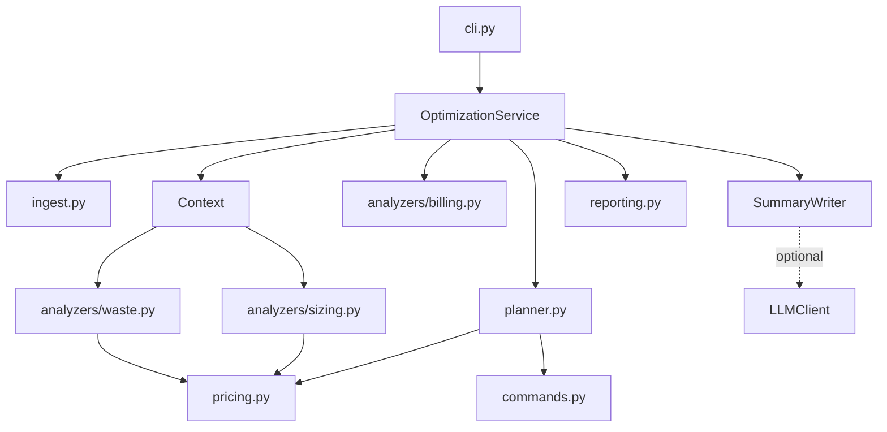

# Architecture

## Overview

`cloudopt` is a stateless batch tool. It reads an inventory and optional billing export, runs analyzers that each
propose changes, lets the planner turn those proposals into a plan whose savings add up, and renders a report.
The composition root (`container.build_service`) wires the summary writer, and `OptimizationService` is the
facade the CLI and library callers use. The price catalogue and the policy are plain inputs to `analyze`, so a
library caller can supply their own without touching the service.

## Modules

| Module | Responsibility |
| ------ | -------------- |
| `models.py` | `Resource`, `Metrics`, `BillingLine`, `Recommendation`, `Anomaly`, `Allocation`, `Report` |
| `pricing.py` | Instance types with sizes and hourly prices, storage tiers, commitment discounts, and a loader for overrides |
| `config.py` | Settings and the `Policy` that holds every threshold and protection rule |
| `ingest.py` | Line-by-line loading with size and count limits that never echoes content |
| `analyzers/base.py` | `Context`, confidence from observation length, and `make_rec` |
| `analyzers/waste.py` | Idle and orphaned resources |
| `analyzers/sizing.py` | Rightsizing, schedules and storage tiering |
| `analyzers/billing.py` | Cost anomalies with attribution, and allocation by tag |
| `planner.py` | Ordering, de-duplication, protection, residual pricing, commitments and totals |
| `commands.py` | Provider CLI commands with every inventory value shell-quoted |
| `reporting.py` | Markdown, JSON and CSV |
| `simulate.py` | A deterministic multi-cloud estate with billing |

## Analyzers propose, the planner decides

Each analyzer returns recommendations with a `fraction`: the share of the resource's remaining monthly cost that
the change removes. Waste is 1.0, rightsizing is one minus the price ratio of the two sizes, a schedule is one
minus scheduled hours over 168, and a tier move is its net saving over the bucket's cost. Analyzers do not know
about each other.

The planner sorts a resource's recommendations by category (waste, rightsize, schedule, storage tier), keeps only
the waste one if there is one, then walks them keeping a residual cost per resource. Each saving is
`residual x fraction`, and the residual shrinks by that amount. That is why the total cannot exceed the spend and
why combining changes never double counts.

## Confidence, risk and effort

Confidence comes from how long the resource was observed: at least 28 days (and twice the minimum) is high, at
least the minimum is medium, less is low. Risk reflects what happens if the recommendation is wrong: production
and databases raise it, deleting an unattached disk (after a snapshot) is low. Effort is a rough size of the work.

## Commitments

After the per-resource plan, the planner groups running VMs by provider. A VM is eligible when it is running, has
enough history, and is not scheduled, deleted or flagged idle (blocked findings count). The recommendation is
`sum(residual) x coverage x discount`. It uses the residual after rightsizing, so it never commits to capacity the
plan is about to remove.

## Anomalies

For each service, daily cost is summed. The most recent days (default 3) are compared with the median of the
earlier 28. A service is flagged when the recent cost exceeds the baseline by both an absolute and a percentage
threshold and is far enough from the history in robust deviations (median absolute deviation). A perfectly flat
history counts as infinitely tight. If every recent day is high it is a shift, otherwise a spike. The resources
whose daily cost grew most are listed as the likely cause.

## Extending

- New rule: add a function that takes a `Context` and returns recommendations built with `make_rec`. Register it
  in `service.analyze`. Test the firing case, the boundary and a near miss.
- New resource type: add it to `ResourceType`, teach the waste analyzer about it, and add command templates.
- New provider: add prices in `pricing.py` (or a pricing file) and command templates in `commands.py`.
